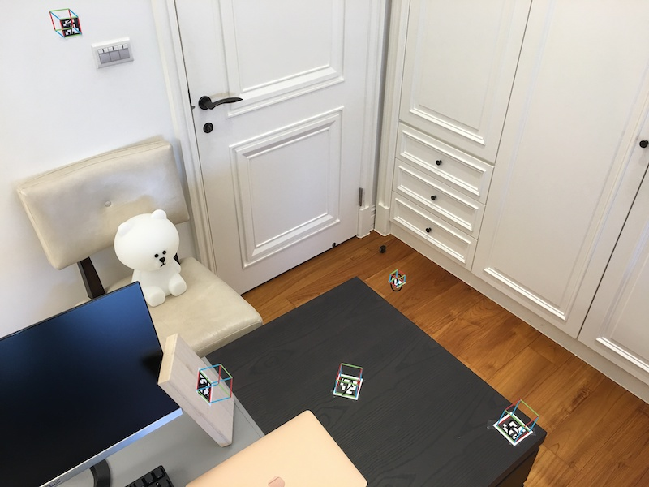

# MarkerPoseEstimation
[ArUco marker](http://www.uco.es/investiga/grupos/ava/node/26) 6D pose estimation tool wrapped in [Docker](https://www.docker.com/). This program is based on the [ArUco module](https://github.com/opencv/opencv_contrib/tree/master/modules/aruco) in [OpenCV](https://opencv.org/).

<p float="left">
  
   
</p>

## Preparation
1. [Install Docker](https://docs.docker.com/install/)
    - [Install Docker Engine - Community on Ubuntu](https://docs.docker.com/install/linux/docker-ce/ubuntu/)
    - [Install Docker Engine - Community on CentOS](https://docs.docker.com/install/linux/docker-ce/centos/)
    - [Install Docker Desktop on Mac](https://docs.docker.com/docker-for-mac/install/)
    - [Install Docker Desktop on Windows](https://docs.docker.com/docker-for-windows/install/)
    - [Other information](https://docs.docker.com/install/)

2. Build the environment for the tool
    ```bash
    ./mpe build
    ```

3. Compile the marker creation and pose estimation tools
    ```bash
    ./mpe compile
    ```

4. Prepare  a `config.yml` file.
    - The `config.yml` file should be placed under [`input`](./input) directory.
    - Parameters
        - `num_markers`: The number of markers you would like to create. The number should be less than 50.
        - `marker_size_pixel`: The output size (in pixel) of the marker you would like to create. The size should be larger than 30x30 square pixels.
        - `marker_size_meter`: Tha actual marker size (in meter) you have printed out.
        - `camera_intrinsic`: Camera intrinsic matrix.
          - `fx`, `fy`: The camera focal length.
          - `cx`, `cy`: The optical center expressed in the pixel coordinate.
        - `distortion_coeff`: Five distortion parameters
          - `k1`, `k2`, `p1`, `p2`, `k3`: Distortion parameters.
        - For more information about the camera intrinsic matrix and the distortion coefficients, please refer to the [this page](https://docs.opencv.org/2.4/doc/tutorials/calib3d/camera_calibration/camera_calibration.html).
    - A [`config.yml`](./samples/config.yml) sample:
        ```yaml
        %YAML:1.0
        num_markers: 9
        marker_size_pixel: 189
        marker_size_meter: 0.05
        camera_intrinsic:
          fx: 3.4670968597818287e+03
          fy: 3.4670968597818287e+03
          cx: 2016
          cy: 1512
        distortion_coeff:
          k1: -7.6732037665501282e-02
          k2: -8.8342039729904920e-01
          p1: 0
          p2: 0
          k3: 1.7384145834167930e+00
        ```

## Create markers
Base on the [`input/config.yml`](./input/config.yml) file. There will have `num_markers` distinct markers with index `0` to `num_markers - 1` be created. They will be stored in the `output` directory.
- Simple command
  ```bash
  ./mpe create_markers
  ```
- [Samples](./samples/markers): The actual size of the marker will be 50x50 mm if [the pdf file](./samples/markers/markers_50mm.pdf) is printed with 100% scaling.
  <p float="left">
    
     
     
  </p>
  <p float="left">
    
     
     
  </p>
  <p float="left">
    
     
     
  </p>

## Estimate the marker pose
Estimate the pose of markers in the image. As default, The program will read every file in [`input/images`](input/images) directory. Parameters (`marker_size_meter`, `camera_intrinsic`, and `distortion_coeff`) should be given in the [`input/config.yml`](./input/config.yml) file in order to accurately estimate the actual pose of the marker. The program also read a single image or a folder of images with command line. Finally, the output image and the estimation result in `.yml` will be stored in the `output` directory. In the output `estimation.yml`, the translation (in meter) and the rotation (in [quaternion](https://en.wikipedia.org/wiki/Quaternion)) from the camera frame to the frame of the detected markers is recorded. More options will be listed in [next section](https://github.com/thhuang/MarkerPoseEstimation#execute-with-the-mpe-helper-script).
- [A sample image](./samples/images) for demo is in [`input/images`](./input/images) directory. The corresponding camera parameters is in both [`config.yml`](./input/config.yml) and [`iPhone6s_plus_camera_calibration_photo_live_mode.xml`](samples/iPhone6s_plus_camera_calibration_photo_live_mode.xml), which is the parameters of my iPhone 6s Plus calibrated with [the calibration script](https://github.com/opencv/opencv/blob/master/samples/cpp/tutorial_code/calib3d/camera_calibration/camera_calibration.cpp) from [OpenCV](https://opencv.org/)

  

## Execute with the `mpe` Helper Script
The name `mpe` stands for Marker Pose Estimation. To ease the docker operations and abstract the implementation, a helper script `mpe` is provided. `mpe` script is a handy shortcut to issue docker related commands. The marker creation and pose estimation processes will run in the docker container.
### Usage
```shell
./mpe <command> [arguments]
```
Available commands:
- `build`: Build the environment.
- `compile`: Compile the marker creation and pose estimation tools.
- `create_markers`: Literally, create markers.
  - Markers will be stored in `output` directory.
- `estimate`: Estimate the pose of markers in the given image.
  - The result, `estimation.yml`, and the output images will be stored in `output` directory.
  - Arguments:
    - Run with default input path [`input/images`](./input/images).
      - A example:
        ```
        ./mpe estimate
        ```
    - Estimate every image in a given directory.
      - Examples:
        ```
        ./mpe estimate PATH_TO_A_DIRECTORY_WITH_IMAGES
        ./mpe estimate ~/Desktop/input
        ```
    - Estimate a single image.
      - Examples:
        ```
        ./mpe estimate PATH_TO_A_IMAGE
        ./mpe estimate ~/Desktop/input/test.jpg
        ```
        
## Issue
Since the marker pose is estimated separately with only 4 coplanar points, it may have two geometrically feasible solutions, such as the incorrectly calculated pose of the marker in the upper left corner of the figure below. This is a well-known ambiguity when solving [PnP (Perspective-n-Point)](https://en.wikipedia.org/wiki/Perspective-n-Point) problems. The ambiguity may be solved with more accurate detection of the corner of the marker by getting closer to the markers, using bigger markers, using a camera with higher resolution, fine tunning parameters of the corner detection algorithm according to the camera, estimating the pose with multiple marker information, estimating the pose with temporal information, or using other error reducing strategies.

